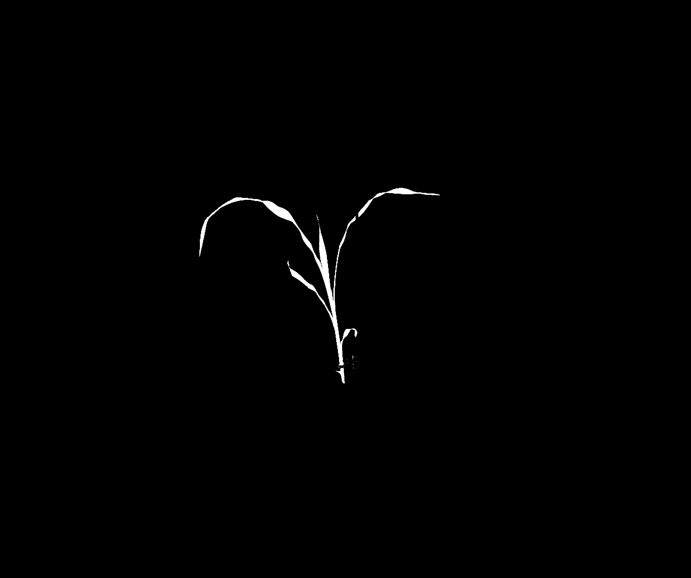
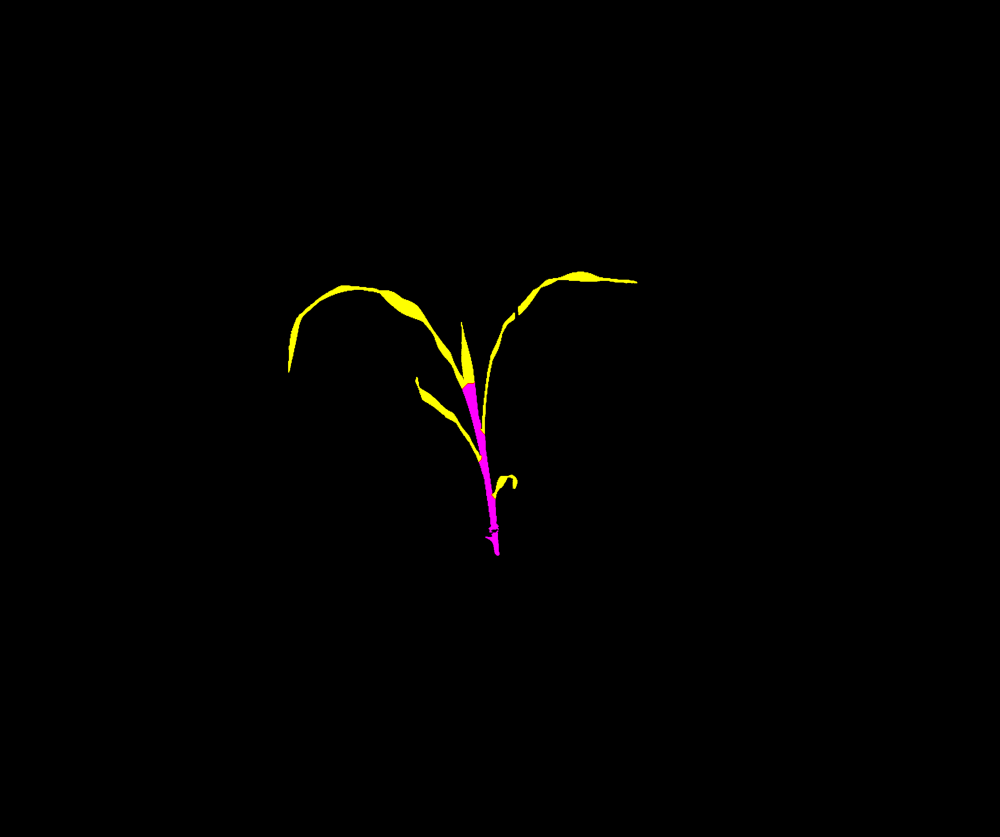

</img></img></img>

# DDPSC PhenotyperCV
This program has multiple features that are selected for using `-m` flag indicating the "mode" you'd like execute. As developement continues, new modes will become available to expand the use of this program to problems outside the framework of Bellweather platform. Current modes are listed here and futher information can be found using the `-h` flag. 

### Modes
* VIS - Segment and measure plant in RGB images
* VIS_CH - Color correct, segment, and measure plant in RGB images
* VIS_CH_CHECK - Color correct, and output image for viewing
* SET_TARGET - Obtain and print to stdout the RGB information for each of the chips in the image
* DRAW_ROIS - GUI for making card_masks/ images to be used by VIS_CH, VIS_CH_CHECK, and SET_TARGET
* AVG_IMGS - Pipe in list of input images to be averaged and outputs average_images.png
* NIR - Segment and measure plant in near-infrared images
* CHARUCO_CREATE - Creates a nx by ny ChArUco board with mw marker width and aw aruco chip width using d dictionary
* CHARUCO_CALIB - Camera calibration using multiple viewpoints of a ChArUco board
* CHARUCO_EST - Warps the image to the orthogonal plane projection using calibration file from CHARUCO_CALIB
* SVM_CREATE - Creates a SVM classifier from input image and respective labeled image
* BC_CREATE - Creates a Bayesian classifer from input image and respective labeled image


### Building the program
PhenotyperCV is dependent on two packages: OpenCV and Eigen3. Additionally, the OpenCV installation must have been with the extra modules enabled, namely: aruco, ml, and ximgproc. This program must be compiled from source and is made easier with `cmake`  
1. First clone the repository
```bash
git clone https://github.com/jberry47/ddpsc_phenotypercv
```
2. Create a build directory
```bash
cd ddpsc_phenotypercv && mkdir build && cd build
```
3. Initialize the build
```bash
cmake ..
```
4. If there were no errors or warnings then you can build the program
```bash
make
```
If you have an unconventional installation of Eigen you'll need to comment out the find_packages for Eigen in the CMakeList.txt and manually add the path to your installation with `-DCMAKE_MODULE_PATH=/path/to/install/eigen/Eigen` 

### Building the program on DDPSC Infrastructure
Both OpenCV and Eigen3 depedencies are in unconventional locations that are not found with cmake. To build the program on the infrastructure, `misc/pull_compile_phenocv.sh` is a bash script that MUST BE EDITED to your file paths and will first pull the repository, and execute a series of g++ commands that will create the executable and clean up all temporary files during the build. Alternatively, a pre-built executable exists already in `/home/jberry/programs/PhenotyperCV`.

After a successful build, you can read the help page with `./PhenotyperCV -h`

### DDPSC Datasci Cluster Usage
Example condor job file and accompanying executable for processing images on the DDPSC infrastructure can be found in the `misc` directory
* phenotypercv.submit - condor submit file that MUST BE EDITED to your file paths and image location
* run_phenocv.sh - the executable that the job file calls and MUST BE EDITED to your file paths and image location

