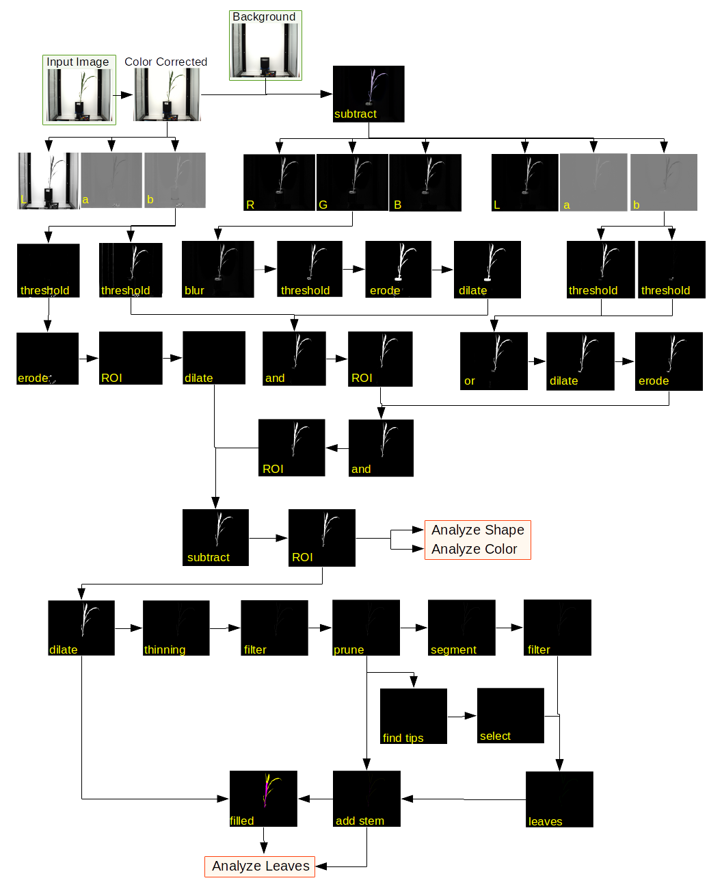
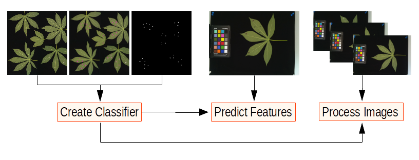

</img></img></img>

# DDPSC PhenotyperCV
This program has multiple features that are selected for using `-m` flag indicating the "mode" you'd like execute. As development continues, new modes will become available to expand the use of this program to problems outside the framework of Bellweather platform. Current modes are listed here and futher information can be found using the `-h` flag. 

### Modes
* **VIS** - Segment and measure plant in RGB images
* **VIS_CH** - Color correct, segment, and measure plant in RGB images
* **VIS_CH_CHECK** - Color correct, and output image for viewing
* **SET_TARGET** - Obtain and print to stdout the RGB information for each of the chips in the image
* **DRAW_ROIS** - GUI for making card_masks/ images to be used by VIS_CH, VIS_CH_CHECK, and SET_TARGET
* **AVG_IMGS** - Pipe in list of input images to be averaged and outputs average_images.png
* **NIR** - Segment and measure plant in near-infrared images
* **CHARUCO_CREATE** - Creates a ChArUco board with specified sizes and dictionary
* **CHARUCO_CALIB** - Camera calibration using multiple viewpoints of a ChArUco board
* **CHARUCO_EST** - Warps the image to the orthogonal plane projection using calibration file from CHARUCO_CALIB
* **SVM_CREATE** - Creates a SVM classifier from input image and respective labeled image
* **SVM_PRED** - Uses provided SVM classifier to predict features in input image
* **SVM_STAT** - Outputs svm classifier statistics from labeled image and classifier input
* **BC_CREATE** - Creates a Bayesian classifer from input image and respective labeled image
* **BC_PRED** - Uses provided Bayes classifier to predict features in input image
* **BC_STAT** - Outputs bayes classifier statistics from labeled image and classifier input
* **WS** - Takes classifier and input image and outputs measurements of objects within user selected regions

### Bellweather Workflows
##### VIS_CH Workflow
1. Average together all the empty pots using AVG_IMGS
2. Create card_masks directory and use DRAW_ROIS to create the chip masks
3. Set the averaged image to target for color correction using SET_TARGET
4. Run the analysis with the averaged image as background using VIS_CH

##### VIS Workflow
1. Average together all the empty pots using AVG_IMGS
2. Run the analysis with the averaged image as background using VIS

##### NIR Workflow
1. Average together all the empty pots using AVG_IMGS
2. Run the analysis with the averaged image as background using NIR

In both the VIS and VIS_CH, the plant is segmented using the following protocol: 
</img>

### Output files
##### Shapes
> VIS_SV_0_z1_h1_g0_e65_v500_new_145496_0.png 78513 448624 0.175008 13860.8 673 1282 1407.28 584.593 21 1998.52 1499.91 2606.46 1262.9 164.149 1.01536 0.0051354 0.484527 2.06387 1.46097 0 -0.100173

Each line in the file has meta data: image name, area, hull_area, solidity, perimeter, width, height, center of mass x, center of mass y, hull verticies, ellipse center x, ellipse center y, ellipse major axis, ellipse minor axis, ellipse angle, ellipse eccentricity, circularity, roundness, aspect ratio, fractal dimension, out of frame, image quality.

##### Color
> VIS_SV_0_z1_h1_g0_e65_v500_new_145496_0.png 0 0 0 2 1 2 4 15 17 30 35 39 61 69 117 119 125 152 159 198 241 299 336 462 500 584 721 810 899 1033 907 1120 1170 1326 1550 1904 2190 2576 3375 3882 4653 5805 6750 7630 7640 7807 4866 3273 1586 773 309 150 82 32 34 23 14 18 9 9 2 5 6 3 1 1 1 0 1 0 0 0 0 0 0 0 0 0 0 0 0 0 0 0 0 0 0 0 0 0 0 0 0 0 0 0 0 0 0 0 0 0 0 0 0 0 0 0 0 0 0 0 0 0 0 0 0 0 0 0 0 0 0 0 0 0 0 0 0 0 0 0 0 0 0 0 0 0 0 0 0 0 0 0 0 0 0 0 0 0 0 0 0 0 0 0 0 0 0 0 0 0 0 0 0 0 0 0 0 0 0 0 0 0 0 0 0 0 0 0

Each line in the file has meta data: image name, hue histogram from 0-180 in bins of two.

##### Leaves
>VIS_SV_0_z1_h1_g0_e65_v500_new_145496_0.png 0 868 29.1548 65 2.22948
VIS_SV_0_z1_h1_g0_e65_v500_new_145496_0.png 1 3781 255.039 270 1.05866
VIS_SV_0_z1_h1_g0_e65_v500_new_145496_0.png 2 5668 377.69 429 1.13585
VIS_SV_0_z1_h1_g0_e65_v500_new_145496_0.png 3 18556 611.756 832 1.36002
VIS_SV_0_z1_h1_g0_e65_v500_new_145496_0.png 4 23309 320.295 340 1.06152
VIS_SV_0_z1_h1_g0_e65_v500_new_145496_0.png 5 23309 353.99 354 1.00003

For each image processed multiple entries are created, one for each leaf blade found. The meta data for this file is: image name, leaf blade number, area, euclidean distance from branch to tip, geodesic distance from branch to tip, tortuosity. 

##### NIR
> NIR_SV_0_z1_h1_g0_e18000_v500_103283_0.png 0 0 0 0 0 0 0 0 0 0 0 0 0 0 0 0 0 0 0 0 0 0 0 0 0 0 0 0 0 0 0 0 0 0 0 0 0 0 0 0 0 0 0 0 0 0 0 0 1 3 4 6 2 8 13 26 24 33 52 37 48 30 43 56 84 98 117 124 109 113 136 154 170 195 216 218 212 227 245 243 215 194 232 230 211 202 212 207 218 234 260 230 211 225 193 162 153 128 115 118 114 131 125 98 97 59 47 52 37 25 13 4 1 1 2 0 0 0 0 0 0 0 0 0 0 0 0 0 0 0 0 0 0 0 0 0 0 0 0 0 0 0 0 0 0 0 0 0 0 0 0 0 0 0 0 0 0 0 0 0 0 0 0 0 0 0 0 0 0 0 0 0 0 0 0 0 0 0 0 0 0 0 0 0 0 0 0 0 0 0 0 0 0 0 0 0 0 0 0 0 0 0 0 0 0 0 0 0 0 0 0 0 0 0 0 0 0 0 0 0 0 0 0 0 0 0 0 0 0 0 0 0 0 0 0 0 0 0 0 0 0 0 0 0 0 0 0 0 0 0 0 0 0 0 0

Each line in the file has meta data: image name, grayscale histogram from 0-255

### Machine Learning Workflow
1. Make training image as a collage of several test images
2. Use the pencil tool in ImageJ and draw over all features of interest
3. Convert to Lab, split channels, and find L
4. Threshold the image to get the feature mask and save it
5. Train naive Bayes or SVM using either BC_CREATE or SVM_CREATE
6. Check the classifier prediction using either BC_PRED or SVM_PRED
7. If prediction is satisfactory, process images using WS specifying classifier type

</img>

The processing step consists of four phases:
1. Click only the gray scale color chips from black to white
2. Feature prediction of input image
3. Threshold the prediction to isolate features
4. Click on the features to measure
If there are different types of features that you'd like to consider separate, currently only three different features are supported and you can specify them by which type of mouse click you use. Left = red, right = green, middle = blue. 

### Building the program
PhenotyperCV is dependent on two packages: OpenCV and Eigen3. Additionally, the OpenCV installation must have been with the extra modules enabled, namely: aruco, ml, and ximgproc. This program must be compiled from source and is made easier with `cmake`

##### Making a directory for all builds
```bash
mkdir big_build && cd big_build
export my_path=$(pwd)
```

##### Getting Eigen3 and installing
```bash
wget "http://bitbucket.org/eigen/eigen/get/3.3.7.tar.bz2" -O"eigen-3.3.7.tar"
tar -xf eigen-3.3.7.tar
cd eigen-eigen-323c052e1731
mkdir build && cd build
cmake -DCMAKE_INSTALL_PREFIX=/usr ..
sudo make install
sudo cp -r /usr/include/eigen3/Eigen /usr/include/
```

##### Getting OpenCV extra modules
```bash
wget https://github.com/opencv/opencv_contrib/archive/4.1.1.tar.gz -O"opencv_contrib-4.1.1.tar.gz"
tar -xzf opencv_contrib-4.1.1.tar.gz
cd opencv_contrib-4.1.1/modules
rm -rv !("aruco"|"ximgproc") 
```

##### Getting OpenCV and installing
```bash
wget https://github.com/opencv/opencv/archive/4.1.1.tar.gz -O"opencv-4.1.1.tar.gz"
tar -xzf opencv-4.1.1.tar.gz
cd opencv-4.1.1
mkdir build && cd build
cmake .. -DOPENCV_EXTRA_MODULES_PATH=$my_path/opencv_contrib-4.1.1/modules
make -j8
sudo make install
```

##### Getting PhenotyperCV and building
```bash
git clone https://github.com/jberry47/ddpsc_phenotypercv
cd ddpsc_phenotypercv && mkdir build && cd build
cmake ..
make
export PATH=$PATH:$my_path/ddpsc_phenotypercv/build
```

If you have an unconventional installation of Eigen you'll need to comment out the find_packages for Eigen in the CMakeList.txt and manually add the path to your installation with `-DCMAKE_MODULE_PATH=/path/to/install/eigen/Eigen` 

### Building the program on DDPSC Infrastructure
Both OpenCV and Eigen3 depedencies are in unconventional locations that are not found with cmake. To build the program on the infrastructure, `misc/pull_compile_phenocv.sh` is a bash script that MUST BE EDITED to your file paths and will first pull the repository, and execute a series of g++ commands that will create the executable and clean up all temporary files during the build. Alternatively, a pre-built executable exists already in `/home/jberry/programs/PhenotyperCV`.

After a successful build, you can read the help page with `./PhenotyperCV -h`

### DDPSC Datasci Cluster Usage
Example condor job file and accompanying executable for processing images on the DDPSC infrastructure can be found in the `misc` directory
* **phenotypercv.submit** - condor submit file that MUST BE EDITED to your file paths and image location
* **run_phenocv.sh** - the executable that the job file calls and MUST BE EDITED to your file paths and image location

